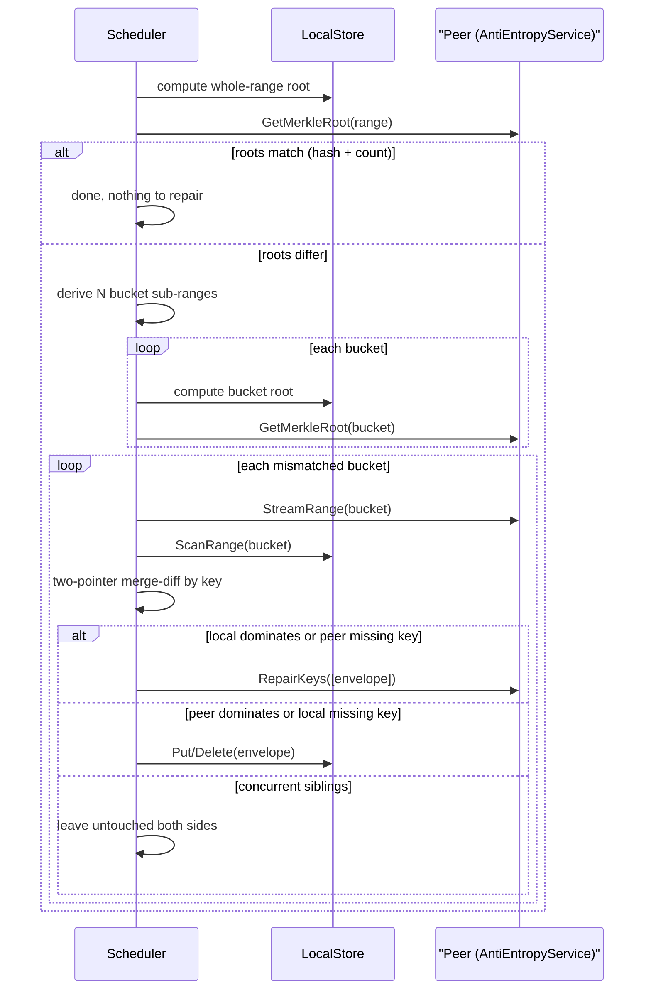

# Phase 6: Anti-Entropy

## Context

`AntiEntropyService` (`GetMerkleRoot`, `StreamRange`, `RepairKeys`) is already fully defined in [proto/cluster/v1/cluster.proto](proto/cluster/v1/cluster.proto) (lines 182-260) with generated bindings in [src/cluster/transport/pb/cluster_grpc.pb.go](src/cluster/transport/pb/cluster_grpc.pb.go), but has zero implementation anywhere in the repo - this phase implements it entirely. No proto/wire changes are needed.

Neither existing Merkle tree in [src/models/merkle_tree/](src/models/merkle_tree/) is reusable: `merkle.go`'s `MerkleTree` hashes per-SSTable value-write-order (used only by `ss_parser`/`ss_compacter`, and never read back), and `merkle_tree.go`'s `Node`-based tree is fully dead code. Phase 6's range-keyed Merkle logic is greenfield, built in a new `src/cluster/antientropy` package.

Confirmed design decisions (from prior discussion):
- **Bucketing**: fixed `N` buckets per owned range, derived deterministically so both replicas compute identical boundaries independently - no new wire messages needed.
- **Repair semantics**: only propagate causally-dominant versions (stragglers who missed a write); leave genuine concurrent conflicts untouched on both sides - `Coordinator.Get`'s existing sibling exposure (Phase 5) remains the only way conflicts surface to clients.
- **Bootstrap**: no separate `BootstrapService` implementation. An empty/new replica for a range is just the extreme case of anti-entropy (empty local root vs full remote root triggers a full repair pass). `BootstrapService` proto stubs stay unimplemented (documented as deferred tech debt).
- **Tombstone GC / `safeCompactionLSN`**: explicitly out of scope for this phase; stays deferred (documented as remaining tech debt).

## Repair round flow

## Bucketing algorithm

A pure helper `SplitRange(start, end string, n int) []Range` in the new package: treats the first several bytes of `start`/`end` as big-endian integers (empty `end` treated as a maximum sentinel for the math only) and interpolates `n` evenly-spaced boundaries. The *last* bucket's real upper boundary sent over the wire stays `""` to match the engine's existing unbounded-end convention (see `ring.Range`'s half-open semantics in [src/cluster/ring/range.go](src/cluster/ring/range.go)). Both replicas derive identical boundaries independently from `(Range, N)` alone, so `MerkleRootRequest{range_start,range_end}` is reused verbatim for both the coarse whole-range check and each bucket check - no new proto messages.

Known simplification (goes into `TECH_DEBT.md`): assumes a roughly uniform key distribution over the interpolated byte prefix; heavily skewed keys (e.g. shared long prefixes) produce uneven buckets.

## Root hashing

`GetMerkleRoot` scans the requested sub-range (via a `LocalStore`-shaped interface backed by [src/cluster/node/store.go](src/cluster/node/store.go)'s existing `ScanRange`), sorts by key defensively, and feeds `(key, rawValue)` pairs into a streaming xxhash digest (same dependency already used by `bloom_filter`) - hashing the raw stored envelope string directly, no decode needed unless a mismatch is found. Returns `(root_hash, item_count)`; both must match for two sides to be in sync.

Known simplification: full sub-range scan per round, O(range size) time/memory - no incremental Merkle maintenance (same category as existing "no SSTable summaries" debt).

## Repair classification (per key, once a bucket mismatch is found)

Reuses `versioning.Compare` on decoded `versioning.Envelope.VectorClock` (from [src/cluster/versioning/reconcile.go](src/cluster/versioning/reconcile.go) and [src/cluster/versioning/vector_clock.go](src/cluster/versioning/vector_clock.go)):
- Present only on one side -> straggler catch-up: pull locally (`LocalStore.Put/Delete`) or push to peer (`RepairKeys`).
- Present both sides, dominance relation (`Before`/`After`) -> propagate the dominant envelope to the lagging side.
- `Concurrent` -> genuine sibling conflict, left untouched on both sides (no action).
- `Equal` clocks but differing raw bytes (shouldn't happen under correct operation) -> logged and skipped defensively.

Repairs reuse the exact same `LocalStore.Put(key, envelope, sync)` / `Delete(...)` interface `Coordinator` already uses in [src/cluster/coordination/coordinator.go](src/cluster/coordination/coordinator.go) - applying an already-stamped envelope verbatim, no clock incrementing, no new local-storage API needed. `node.NodeStore` structurally satisfies this already.

## New package: `src/cluster/antientropy`

Following the established decoupled-leaf-interface convention (adapters supplied by `cmd/node`, mirroring `ring.PeerEpochSource` / `coordination.AddressResolver`):
- `SplitRange` - pure boundary math (Commit 1, done).
- Root-hash computation over a `LocalStore`-shaped scan interface.
- `Server` implementing `pb.AntiEntropyServiceServer` (`GetMerkleRoot`, `StreamRange`, `RepairKeys`), gated by an ownership check mirroring [src/cluster/node/server.go](src/cluster/node/server.go)'s `OwnsKeyRange` pattern.
- `Client` - outbound RPC surface against a peer's `AntiEntropyService`, own gRPC connection cache (consistent with the already-tracked multi-connection-cache tech debt from `membership.Client`/`ring.Client`/`coordination.Client`).
- `Scheduler` - background ticker (`Start`/`Stop`, same shape as `ring.Syncer`/`Gossiper` in [src/cluster/membership/gossiper.go](src/cluster/membership/gossiper.go)): each tick, for every locally owned range, picks one other replica and runs one recursive tree-diff round (the `diffNode` walk above) against it. Peer selection comes purely from the range's replica list; a failed RPC is just treated as a miss for that tick (same philosophy as `Coordinator`'s fan-out).

New config in [src/cluster/config/config.go](src/cluster/config/config.go): `AntiEntropyInterval`, `AntiEntropyTimeout`, `AntiEntropyFanout` (children per tree level, default 4), `AntiEntropyLeafItemThreshold` (stop recursing once a mismatched node's item_count is at or below this, default e.g. 32), `AntiEntropyMaxDepth` (hard recursion safety cap, default e.g. 6) - same `fileConfig`/defaults/validation pattern as the existing `ReplicationTimeout`.

## Commits

1. ~~`antientropy.SplitRange`~~ - done (deterministic sub-range boundary interpolation, pure function, extensively tested). Reused unchanged as the per-level primitive below.
2. Config: `AntiEntropyInterval`/`AntiEntropyTimeout`/`AntiEntropyFanout`/`AntiEntropyLeafItemThreshold`/`AntiEntropyMaxDepth` + tests, following the `ReplicationTimeout` pattern in [src/cluster/config/config_test.go](src/cluster/config/config_test.go).
3. Root-hash computation: streaming xxhash over sorted `(key, rawValue)` pairs against a `LocalStore`-shaped scan interface + tests (empty range, single key, ordering independence from scan order).
4. `antientropy.Server` (`GetMerkleRoot`, `StreamRange`, `RepairKeys`) with ownership gating + tests, mirroring [src/cluster/node/server_test.go](src/cluster/node/server_test.go)'s style (happy path, not-owner rejection, empty range).
5. `antientropy.Client` (gRPC-backed, own connection cache) + tests.
6. `antientropy.Scheduler` - the recursive `diffNode` tree walk (root compare -> stop-criterion check -> either leaf stream+diff+repair, or split into `Fanout` children and recurse) + comprehensive tests with fakes: already-in-sync no-op at the root (single RPC, no recursion), one-sided-missing-key repaired both directions, dominated-stale-key repaired both directions, genuine concurrent conflict left untouched both sides, recursion actually descends multiple levels when item_count stays above the leaf threshold, recursion stops at `MaxDepth` even if item_count never drops below threshold, recursion stops immediately on a degenerate `SplitRange` result, multi-range ticks.
7. Wire into [cmd/node/main.go](cmd/node/main.go): construct `Server`/`Client`/`Scheduler`, register `AntiEntropyServiceServer`, add a `ringOwnedRanges` adapter (reusing the existing `membershipAddressResolver` for peer dialing), start/stop the scheduler in the node lifecycle.
8. Verification: full sweep (`gofmt`/`go vet`/`go build`/`go test -race`); a live 3-node demo proving repair happens without any quorum read or coordinator involved - kill `node-2`, `Put` via `node-1` at `write_quorum=1` (lands only on `node-1`), restart `node-2`, wait a couple of `AntiEntropyInterval` ticks, then query `node-2` directly via plain `NodeService.Get` to prove the value arrived purely through background repair; update `README.md` and `TECH_DEBT.md` (per-round full-scan cost, bucket-skew/degenerate-collapse assumption, `BootstrapService` remaining unimplemented/deferred).

Implementation proceeds one commit at a time, unstaged, with the user reviewing and committing manually between each, exactly as in prior phases.
